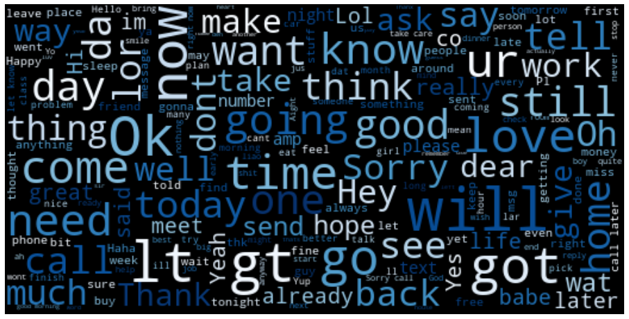
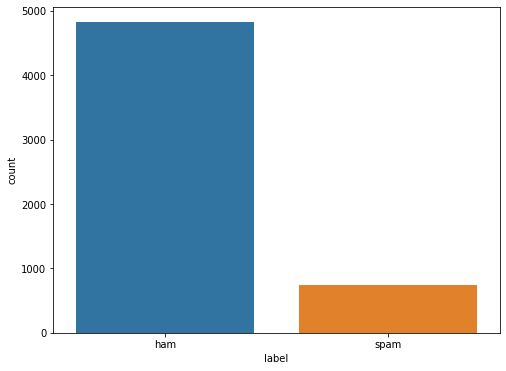
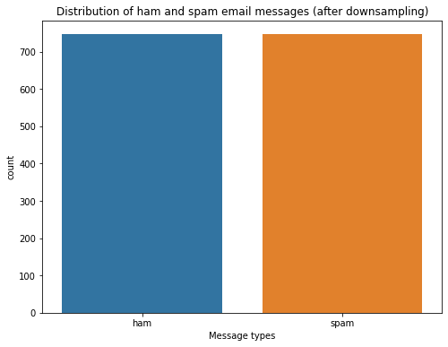
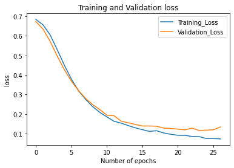
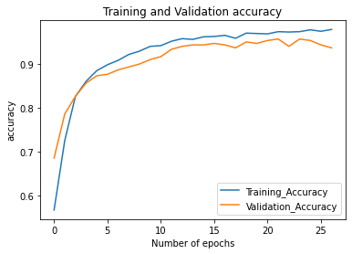
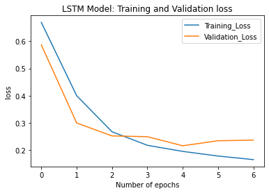
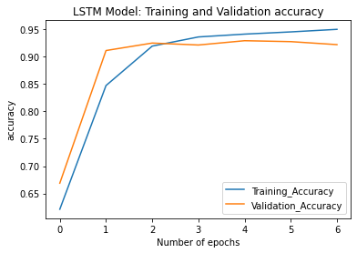
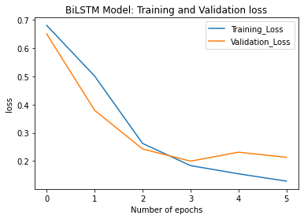
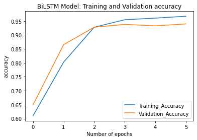

# Spam-Detection-Using-Neural-Networks
Spam Detection    |  
:-------------------------:|
 |

Today, web and online media have become the quickest and most straightforward approaches to get data. In this age, surveys, sentiments, inputs, messages and suggestions have become a critical wellspring of data. Because of the progression in advancements, we are currently ready to remove important data from such information utilizing different Natural Language Processing (NLP) procedures. NLP, a part of Artificial Intelligence (AI), utilizes a computer and human characteristic language to yield important data. NLP is generally utilized in content arrangement assignment, for example, spam location and opinion investigation, text age, language interpretations and archive order.

---

## Outline

1. [Introduction](#introduction)
2. [Dataset](#dataset)
    * [Exploratory Data Analysis](#exploratory-data-analysis)
    * [Data Preprocessing and Preparation](#data-preprocessing-and-preparation)
3. [Classification](#classification)
    * [Dense Model](#dense-model)
    * [LSTM Model](#lstm-model)
    * [Bi-directional LSTM Model](#Bi-directional-lstm-model)
4. [Next Steps](#next-steps)

---

### Introduction
The aim of the project is to employ TensorFlow2 to build a spam detection model in SMS. Specifically a binary classification model is to be developed which will output whether a given message is spam or ham. To make the aforementioned model we use Dense Networks, LSTMs and Bi-directional LSTMs.

### Dataset
The dataset for the project is downloaded from the UCI datasets. The dataset consists of 5574 text messages. This dataset was specifically collected for the purpose of mobile phone spam research with each text being labelled as either 'spam' or 'ham'.  
[Link to dataset](https://raw.githubusercontent.com/AbhinavS99/Spam-Detection-Using-Neural-Networks/main/dataset/SMSSpamCollection)

#### Exploratory Data Analysis
There are 4,825 ham compared to 747 spam messages. This indicates the imbalanced data which we will fix later. The most popular ham message is “Sorry, I’ll call later”, whereas the most popular spam message is “Please call our customer service…” which occurred 30 and 4 times, respectively.

WordCloud for Ham Messages   |  
:-------------------------:|
 |

As observed from WordCloud, the most used words in ham messages are "Ok", "will", "love","now" etc.

WordCloud for Spam Messages   |  
:-------------------------:|
 |

As obserevd from the WordCloud of the spam messages, "Free", "text", "call", "mobile" etc. are the most commonly used words.

Distribution of Spam and Ham Messages   |  
:-------------------------:|
 |

There are most frequent ham messages (85%) than spam (15%).

For handling datasets that are class imbalanced many techniques are available. These include:
1. Oversampling the minority class.
2. Undersampling the majority class.
3. Change of evaluation metrics.
4. Ensembling different resample datasets.  

For the domain of this problem only undersampling of the majority class is done.

Distribution of spam and ham messages after resampling   |  
:-------------------------:|
 |

|Message Type| Average Length |
|-------------|---------------|
|Spam         |   138.670683|
|Ham          |73.238286|

#### Data Preprocessing and Preparation
The following steps would be undertaken for pre-processing the data:
1. Converting the text data label into numeric and performing a train-test split (80/20).
2. The next step is tokenization.
3. The above steps are followed by sequencing and padding.

Finally the following shapes of the tensors are achieved

|Tensor| Shape |
|-------------|---------------|
|Training Tensor | (1195,50)|
|Testing Tensor| (299,50)|

### Methodology
For classification three models are used viz. Dense Network(baseline), LSTM, Bi-directional LSTM. All the models are trained for 30 epochs with early stopping enabled. The loss used is the binary cross entropy loss. The optimizer used is adam and the evaluation metric is accuracy. 

#### Dense Model
Training Loss v/s Validation Loss| Training Accuracy v/s Validation Accuracy |
:-------------------------:|:-----------------:|
 ||

#### LSTM Model
Training Loss v/s Validation Loss| Training Accuracy v/s Validation Accuracy |
:-------------------------:|:-----------------:|
 ||

#### Bi-directional LSTM Model
Training Loss v/s Validation Loss| Training Accuracy v/s Validation Accuracy |
:-------------------------:|:-----------------:|
 ||

|Model|Testing Accuracy|
|-----|----|
|Dense|0.9365|
|LSTM|0.9217|
|Bi-Directional LSTM|0.9695|

|Model|Testing Loss|
|-----|----|
|Dense|0.1335|
|LSTM|0.2370|
|Bi-Directional LSTM| 0.2130|

### Next Steps
We can then investigate additional testing approaches, such as upsampling, SMOTE, and large example. Likewise, we can utilise diverse hyper-boundaries and increment the example size to improve the model further.

